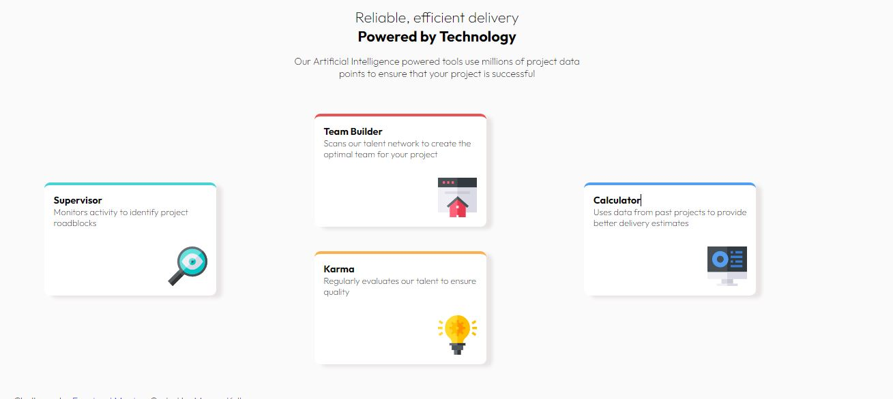

# Frontend Mentor - Four card feature section solution

This is my solution to the [Four card feature section challenge on Frontend Mentor](https://www.frontendmentor.io/challenges/four-card-feature-section-weK1eFYK). The challenges are designed to help one improve their coding skills by building realistic projects.

## Table of contents

- [Overview](#overview)
  - [The challenge](#the-challenge)
  - [Screenshot](#screenshot)
  - [Links](#links)
  - [Built with](#built-with)
  - [What I learned](#what-i-learned)
  - [Continued development](#continued-development)
  - [Useful resources](#useful-resources)
- [Author](#author)

## Overview

This a four card feature section layout built with HTML and styled with CSS.

### The challenge

The user should :

- View the optimal layout for the site depending on their device's screen size

### Screenshot

This is a sreenshot of the layout.

### Links

- Live Site URL: [My live site](https://megankullu.github.io/four-card-feature-section-master/)

### Built with

- Semantic HTML5 markup
- CSS custom properties
- Flexbox
- CSS Grid

### What I learned

I re-inforced my understanding of CSS Grid and used it majorly in laying out the site. I also used flexbox to style components inside the grids.

### Continued development

Looking to implement more challenges using flexbox to perfect my skills.

### Useful resources

- [w3docs](https://www.w3docs.com/snippets/css/how-to-center-the-content-in-grid.html) - This helped me when implementing positions of elements inside a grid container.

## Author

- Website - [Megan Kullu](https://www.megankullu.tech)
- Frontend Mentor - [@MeganKullu](https://www.frontendmentor.io/profile/MeganKullu)
- Twitter - [@megankullu](https://www.twitter.com/megankullu)
